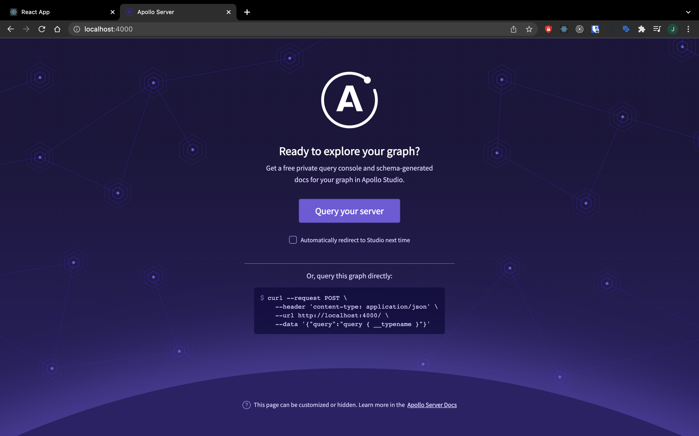

# Kôlnička Jar 2022 - Full-stack webová aplikácia pre všetky tvoje podcasty na jednom mieste!

Toto je oficiálny repozitár pre online workshop Kôlnička Jar 2021.

Na workshope budeme spolu vyvíjať full-stack webovú aplikáciu pomocou nasledujúcich technológií:

- **Backend**
  - [Node.js](https://nodejs.org/)
  - [Express](https://expressjs.com/)
  - [Apollo GraphQL server](https://www.apollographql.com/docs/apollo-server/)
- **Frontend**
  - [React.js](https://reactjs.org/)
  - [Apollo GraphQL client](https://www.apollographql.com/docs/react/)

Obe časti aplikácie budeme vyvíjať v programovacom jazyku [Typescript](https://www.typescriptlang.org/)

## Pred príchodom si pripravte nasledujúce nástroje

- [Node.js](https://nodejs.org/)
  - verzia LTS (16.14.0)
- [Git Bash](https://git-scm.com/downloads)
  - pre Windows používateľov
  - Linux/Mac používateľom stačí pôvodný terminál
- [VSCode](https://code.visualstudio.com/)
  - preferovaný editor, avšak môžete využiť svoj obľúbený
- [Heroku účet (nepovinné)](https://www.heroku.com/)
  - počas workshopu budeme aplikáciu nasadzovať na reálny server. Kto si to chce vyskúšať a mať nasadenú svoju vlastnú verziu aplikácie, bude potrebovať vlastný účet.

## Spustenie projektu

Na začiatu si potrebujeme vyklonovať tento projekt. Môžete využiť ktorúkoľvek z HTTPS/SSH/GitHub CLI metód.

Do terminálu zadáme príkaz:

```bash
git clone git@github.com:jakubarendac/kolnicka-jar-2022
# alebo
git clone https://github.com/jakubarendac/kolnicka-jar-2022.git
```

Následne sa presunieme do novo vytvoreného priečinka pomocou tohto príkazu:

```bash
cd kolnicka-jar-2022
```

Keď sa nachádzame v priečinku, pred prvým spustením projektu potrebujeme nainštalovať všetky knižnice. V termináli spustíme nasledujúce príkazy:

```bash
npm install

npm run bootstrap
```

Po inštalácií knižníc môžeme spustiť projekt. Do terminálu zadáme príkaz:

```bash
npm run start
```

Ak všetko prebehlo úspešne, v príkazovom riadku by sme nemali vidieť žiadne chyby a mali by sme byť sme byť schopní otvoriť nasledujúce linky:

- [Frontend](http://localhost:3000/)
  
- [Backend](http://localhost:4000/)
  
